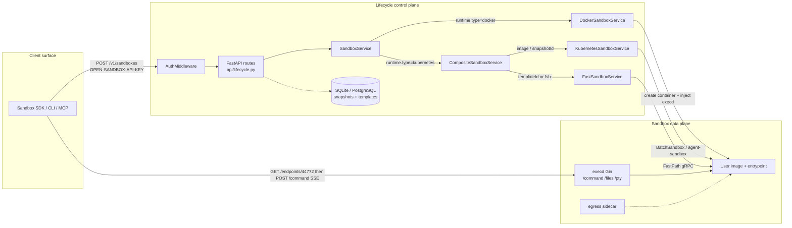

# Contributor Onboarding Plan

This page is a repository-grounded onboarding plan: what OpenSandbox is, how the
code is organized, how a create-and-exec request actually runs, how to work
locally, and where a new contributor can start.

**Analyzed checkout:** `main` at
[`c7dc78a4090e5de2b9119e9bd93952cae24f87bd`](https://github.com/opensandbox-group/OpenSandbox/commit/c7dc78a4090e5de2b9119e9bd93952cae24f87bd)
(`fix(execd): move ParseRange out of the platform files`, 2026-10-01).

**Upstream:** [opensandbox-group/OpenSandbox](https://github.com/opensandbox-group/OpenSandbox).
Issues and pull requests cited below are from that repository.

::: info Assumptions
The original request left background, weekly hours, and contribution interests
blank. This plan assumes an experienced engineer comfortable in **Python and/or
Go**, about **5–8 hours per week**, and a first contribution that does not
require Kubernetes or Fast Sandbox. Phases 4–7 can be swapped to another
subsystem without changing Phases 1–3.
:::

**Inspection coverage.** The analysis read the root docs, contribution and
governance files, architecture overview, server create path, Python SDK
create/command path, execd command path, specs, CI workflows, and then-current
upstream issues and PRs. It did **not** deeply inspect ingress, egress,
node-agent, Kubernetes controller internals, FastSandbox gRPC, or the
non-Python SDKs. Git and `gh` queries were run. The analysis environment did
**not** start the server, run tests, or pull images.

## Evidence classes

| Class | Meaning |
| --- | --- |
| **Verified** | Observed in files in the analyzed checkout, or returned by `git` / `gh` / local tool checks |
| **Inferred** | Reasonable conclusion from those files, not independently executed |
| **Unanswered** | Not enough evidence in the checkout or public GitHub data |

## 1. Understand the project’s purpose

### Problem and users

**Verified.** OpenSandbox is a self-hosted sandbox platform for AI applications.
The root README states the product line as: *“Run AI agents in sandboxes on your
own infrastructure.”* Intended users are:

- Application and agent authors who need isolated command, file, code, browser,
  or desktop execution
- Operators who want Docker locally and Kubernetes in cluster, through one
  lifecycle API
- Platform teams that need ingress/egress control, credential injection, and
  high-throughput pools for evaluation or RL

### Main features and typical usage

**Verified** from the root `README.md` and [/architecture/](/architecture/).

- Lifecycle API: create, list, inspect, pause, resume, renew, delete sandboxes;
  snapshots and templates
- In-sandbox execution via `execd`: commands, files, PTY, bash sessions,
  Jupyter code
- Network control: ingress gateway inbound, per-sandbox egress outbound,
  optional Credential Vault
- Clients: Python / JS / Kotlin / C# / Go SDKs, `osb` CLI, MCP server
- Runtimes: Docker (local/single-host), Kubernetes containers (`BatchSandbox`
  or `agent-sandbox`), optional Fast Sandbox microVMs

Typical usage: start `opensandbox-server` against Docker, then
`Sandbox.create("alpine")` or `osb sandbox create --image python:3.12` and run
commands or files against the resolved execd endpoint.

### In scope / out of scope

**In scope (this repo):** lifecycle server, execd/egress/ingress/node-agent,
Kubernetes operator and Helm charts, public OpenAPI contracts, SDKs/CLI/MCP,
docs, examples, OSEPs.

**Outside this repo (verified):** official sandbox *images* such as
`code-interpreter` live in
[opensandbox-group/sandbox-images](https://github.com/opensandbox-group/sandbox-images)
(`CONTRIBUTING.md`). FastPath / Firecracker host runtime is an external
platform that this repo adapts ([Architecture §4.4](/architecture/#44-fastsandbox-integration)).

**Not currently planned** (`ROADMAP.md`, last updated 2026-04-28): declaring a
stable v1 API; breaking public contracts without an OSEP; provider-specific
features that cannot be isolated from the public API.

### Concepts to learn before reading implementation

1. **Two APIs, two planes.** Lifecycle
   ([`specs/sandbox-lifecycle.yml`](https://github.com/opensandbox-group/OpenSandbox/blob/main/specs/sandbox-lifecycle.yml),
   base `/v1`) is owned by the FastAPI server. Execution
   ([`specs/execd-api.yaml`](https://github.com/opensandbox-group/OpenSandbox/blob/main/specs/execd-api.yaml))
   is owned by in-sandbox `execd`. Clients talk to both.
2. **Runtime-neutral contract, runtime-specific materialization.** Volumes,
   endpoints, `networkPolicy`, and resource limits have one request shape;
   Docker and Kubernetes implement them differently.
3. **`execd` is injected, not assumed.** Docker stages the binary from
   `[runtime].execd_image`. Kubernetes BatchSandbox copies it via init
   container. Fast Sandbox bakes it into the guest image.
4. **Endpoint resolution is part of the contract.** Clients must call
   `GET /v1/sandboxes/{id}/endpoints/{port}` rather than guessing host/port.
5. **Specs are source of truth.** Generated SDK clients are derived;
   handwritten adapters add streaming, errors, and ergonomics
   (`sdks/AGENTS.md`).

### Concrete example

**User gives:**

```python
sandbox = await Sandbox.create("alpine")
execution = await sandbox.commands.run("echo 'Hello OpenSandbox!'")
```

**System produces:**

1. `POST /v1/sandboxes` with image `alpine`, default entrypoint
   `["tail", "-f", "/dev/null"]`, default resources `cpu=1`, `memory=2Gi`
   (`Sandbox.create` in
   [`sdks/sandbox/python/src/opensandbox/sandbox.py`](https://github.com/opensandbox-group/OpenSandbox/blob/main/sdks/sandbox/python/src/opensandbox/sandbox.py)).
2. Server authenticates, validates, starts a Docker container, injects
   `execd`, returns **202** with `id` and `status.state: "Running"` on the
   Docker path (`DockerSandboxService._provision_sandbox`).
3. SDK resolves the execd endpoint (default port 44772), waits for `/ping`,
   then `POST /command` over SSE.
4. User sees `"Hello OpenSandbox!"` in `execution.logs.stdout`.
   `sandbox.destroy()` deletes the container.

## 2. Map the repository and architecture

### Directory map

| Path | Responsibility | Important entry points | Relates to | Kind |
| --- | --- | --- | --- | --- |
| `specs/` | Public OpenAPI contracts | `sandbox-lifecycle.yml`, `execd-api.yaml`, `egress-api.yaml`, `diagnostic-api.yml` | Server, SDKs, CLI, execd, egress | Core contract |
| `server/` | FastAPI lifecycle control plane | `opensandbox_server.main`, `cli.main`, `api.lifecycle.create_sandbox`, `services.factory.create_sandbox_service` | Specs, Docker/K8s/FastSandbox, repos | Core implementation |
| `components/execd/` | In-sandbox execution daemon (Gin) | `main.go`, `pkg/web.NewRouter`, `CodeInterpretingController.RunCommand`, `runtime.Controller.Execute` | execd spec, SDK command/file adapters | Core implementation |
| `components/egress/` | Outbound DNS/nft policy + credential proxy | sidecar `/policy`, Credential Vault routes | lifecycle `networkPolicy`, Fastlet profile | Core implementation |
| `components/ingress/` | K8s HTTP/WS gateway | header/URI/wildcard routing | server endpoint formatting, renew-intent | Core implementation |
| `components/nodeagent/` | Node-side collection | DaemonSet + eBPF helpers | K8s data plane | Core implementation |
| `components/internal/` | Shared Go helpers | supervisor, telemetry, logger | execd/egress/ingress | Supporting |
| `kubernetes/` | Operator, CRDs, task-executor | `cmd/controller`, `BatchSandboxReconciler`, `PoolReconciler` | server K8s provider, Helm | Core implementation |
| `manifests/charts/` | Helm charts | `opensandbox` umbrella + component charts | kubernetes/, server | Supporting / generated-adjacent |
| `sdks/sandbox/*` | Multi-language sandbox SDKs | Python: `Sandbox.create`, `CommandsAdapter.run` | lifecycle + execd specs | Core client |
| `sdks/code-interpreter/*` | Higher-level code execution | builds on sandbox SDK + Jupyter via execd | execd `/code` | Core client |
| `sdks/mcp/sandbox/python` | MCP server | `opensandbox-mcp` | Python sandbox SDK | Core client |
| `cli/` | `osb` CLI | `opensandbox_cli.main`, command groups | Python SDK | Core client |
| `tests/` | Cross-language e2e | `tests/python`, `tests/javascript` | server + SDKs + Docker | Tests |
| `docs/`, `examples/`, `oseps/` | Docs, samples, proposals | VitePress `docs/`, `oseps/NNNN-*.md` | all public surfaces | Docs / process |
| `scripts/` | CI/e2e/fast-sandbox helpers | `scripts/python-e2e.sh`, `scripts/fast-sandbox-env/` | CI | Supporting |

`CONTRIBUTING.md`’s project-structure tree is **stale**: it omits
`kubernetes/`, `cli/`, `components/egress`, `components/ingress`,
`components/nodeagent`, and `manifests/`. Treat root `AGENTS.md` as the
accurate map.

### Architectural boundaries

**Dependency direction (verified from docs + imports):**

```text
Clients (SDK / CLI / MCP)
    -> specs (wire contract)
    -> server (lifecycle, auth, persistence, endpoint formatting)
        -> Docker daemon | K8s API / BatchSandbox | FastPath gRPC
    -> execd / egress (data plane, after endpoint resolution)
```

Clients must not depend on server internals. Server routes must stay thin
(`server/AGENTS.md`). Runtime-specific logic stays in `services/docker/`,
`services/k8s/`, `services/fast_sandbox/`. Generated SDK code is not a place
to hand-patch.

**Major abstractions**

- `SandboxService` (`server/opensandbox_server/services/sandbox_service.py`):
  create/list/get/delete/pause/resume/renew/endpoint
- `create_sandbox_service()`: `runtime.type=docker` →
  `DockerSandboxService`; `kubernetes` →
  `CompositeSandboxService(KubernetesSandboxService, FastSandboxService)`
- `CompositeSandboxService`: `templateId` or fsb snapshot → FastSandbox;
  else Kubernetes; existing IDs with `fsb-` prefix stay on FastSandbox
- Python SDK: generated OpenAPI client + handwritten `*Adapter` + `Sandbox`
  facade
- execd: Gin router → controller → `runtime.Controller.Execute`

**State management**

- Live sandbox state is **not** a server row. Docker containers / K8s CRs /
  FastSandbox CRs are source of truth
  ([Lifecycle Server](/architecture/control-plane/server)).
- Server persists snapshot metadata and the FastSandbox template catalog
  (`repositories/snapshots/`, `repositories/templates/`), SQLite default at
  `~/.opensandbox/opensandbox.db`, optional PostgreSQL.
- Docker expiration is an in-memory timer restored from container labels
  after restart.

**Configuration**

- TOML file `~/.sandbox.toml`, override `SANDBOX_CONFIG_PATH` or `--config`
- Important env: `OPENSANDBOX_SERVER_API_KEY`,
  `OPENSANDBOX_INSECURE_SERVER=YES`, `OPENSANDBOX_STORE_POSTGRESQL_DSN`,
  `OPEN_SANDBOX_API_KEY` (SDK), `DOCKER_HOST`

**External integrations**

Docker Engine, Kubernetes API, optional Redis (renew-intent), PostgreSQL,
OTLP, FastPath gRPC `:9090`, Jupyter inside code-interpreter images, Alibaba
OSS via OSSFS, Cosign/Sigstore for release images.

### Architecture diagram



## 3. Trace real behavior through the code

The representative path is **create a Docker sandbox and run a command**. A
second trace covers **Kubernetes/FastSandbox dispatch**.

### Trace A — Docker create + command

#### Input

`await Sandbox.create("alpine")` then
`await sandbox.commands.run("echo 'Hello OpenSandbox!'")`.

#### 1. SDK create

| Step | File | Symbol |
| --- | --- | --- |
| Validate exactly one of `image` / `snapshot_id`; default entrypoint, resources, timeout | `sdks/sandbox/python/src/opensandbox/sandbox.py` | `Sandbox.create` |
| Shared launch: create, resolve endpoints, health-check, cleanup on failure | same | `Sandbox._launch` |
| Build generated request and `POST /sandboxes` | `sdks/sandbox/python/src/opensandbox/adapters/sandboxes_adapter.py` | `SandboxesAdapter.create_sandbox` → `post_sandboxes.asyncio_detailed` |

**Validation / errors.** `InvalidArgumentException` if both or neither startup
source. On any later failure, `_launch` attempts `kill_sandbox` so a
half-created sandbox is not left behind. Concurrent endpoint lookups use
`_gather_fail_fast` so a 401/403 cancels the sibling poll.

#### 2. Server entry

| Step | File | Symbol |
| --- | --- | --- |
| Load TOML, logging, tenant provider | `server/opensandbox_server/main.py` | module init + `lifespan` |
| API-key auth (header `OPEN-SANDBOX-API-KEY`) | `server/opensandbox_server/middleware/auth.py` | `AuthMiddleware.dispatch` |
| Route | `server/opensandbox_server/api/lifecycle.py` | `create_sandbox` |
| Service selection | `server/opensandbox_server/services/factory.py` | `create_sandbox_service` |

`create_sandbox` calls `validate_extensions`, optionally
`resolve_sandbox_image_from_request`, then
`await sandbox_service.create_sandbox(request)`.

**Auth behavior (verified).** Exempt: `/health`, `/version`, `/docs`,
`/redoc`, `/openapi.json`. Empty `api_key` and no tenant provider skips auth,
but startup requires TTY confirmation or `OPENSANDBOX_INSECURE_SERVER=YES`
(`startup_guard.py`). Proxy paths skip API-key auth in single-tenant mode.

#### 3. Docker provisioning

| Step | File | Symbol |
| --- | --- | --- |
| Reject lifecycle hooks and `poolRef`; validate entrypoint, metadata, platform, timeout, volumes, network policy | `server/opensandbox_server/services/docker/docker_service.py` | `DockerSandboxService.create_sandbox` |
| Blocking Docker work on a daemon thread; await the future | same | `Thread(target=_run)` + `await future` |
| Pull/auth image, allocate ports, optional egress sidecar, create/start container, inject execd via mixin | same + `services/docker/runtime.py` | `_provision_sandbox`, `_fetch_execd_archive` |
| Return Running | `docker_service.py` | `SandboxStatus(state="Running", reason="CONTAINER_RUNNING")` |

**Concurrency.** The FastAPI handler stays async; Docker SDK calls run on a
background thread and are posted back with `loop.call_soon_threadsafe`.
Expiration timers are lock-protected in-memory (`server/DEVELOPMENT.md`).

**Errors.** `HTTPException` 400 for unsupported Docker features and
validation; create-failure path removes sidecar, OSSFS mounts, and managed
volumes.

#### 4. SDK readiness

`Sandbox._launch` polls `get_sandbox_endpoint` for execd (44772) and egress,
builds adapters, then `_check_ready` (`/ping` unless `skip_health_check`).

#### 5. Command execution

| Step | File | Symbol |
| --- | --- | --- |
| Build JSON body, POST SSE | `sdks/sandbox/python/src/opensandbox/adapters/command_adapter.py` | `CommandsAdapter.run` → `_execute_streaming_request` |
| Bind/validate request | `components/execd/pkg/web/controller/command.go` | `RunCommand` |
| Dispatch language | `components/execd/pkg/runtime/ctrl.go` | `Controller.Execute` |
| Spawn process, tail stdout/stderr, SSE events | `components/execd/pkg/runtime/command.go` | `runCommand` |

**Validation.** `RunCommandRequest.Validate()` rejects bad cwd/uid/gid/argv
(`pkg/web/model/codeinterpreting.go`). Empty command string is rejected in the
SDK (`InvalidArgumentException`).

**Async / streaming.** Foreground commands stream SSE until
`execution_complete`. Background commands return after that event and do not
wait for an older grace-period terminator (comment cites #1528). Handler
context is cancelled on client disconnect; process group is signalled. A
short `ApiGracefulShutdownTimeout` sleep keeps the SSE connection open for
late readers.

**Output.** SDK `Execution` with `logs.stdout` / `stderr` and inferred
`exit_code`.

### Trace B — Kubernetes vs FastSandbox

Same `POST /v1/sandboxes`, different service:

- `CompositeSandboxService.create_sandbox`
  (`services/composite_service.py`): `templateId` or fsb-restored snapshot →
  `FastSandboxService`; otherwise `KubernetesSandboxService`
- Kubernetes waits for Running + pod IP:
  `KubernetesSandboxService.create_sandbox` → `_wait_for_sandbox_ready`
- FastSandbox talks to external FastPath gRPC
  (`services/fast_sandbox/fastpath_client.py`)
- Existing-object routing is by ID prefix `fsb-`

**Inferred.** Create is still request-scoped (the HTTP call waits), but
Kubernetes wait is poll-inside-the-handler rather than “return Pending
immediately.” That is exactly where the architecture docs disagree with the
spec (below).

### Tests that demonstrate this path

| Layer | Tests |
| --- | --- |
| Route / OpenAPI | `server/tests/test_routes_create_delete.py` (`test_create_sandbox_returns_202_and_service_payload`, `test_create_sandbox_openapi_describes_synchronous_provisioning`) |
| Docker service | `server/tests/test_docker_service.py`, `test_docker_runtime_bootstrap.py` |
| Composite routing | `server/tests/test_composite_service.py` |
| Auth | `server/tests/test_auth_middleware.py`, `test_main_api_key_guard.py` |
| SDK create | `sdks/sandbox/python/tests/test_sandbox_business_logic.py` |
| SDK command SSE | `sdks/sandbox/python/tests/test_sync_command_service_adapter_streaming.py` and async counterparts |
| execd command | `components/execd/pkg/runtime/command_test.go`, `pkg/web/model/codeinterpreting_test.go` |
| Live e2e (needs Docker) | `tests/python/tests/test_sandbox_e2e.py`; CI: `.github/workflows/real-e2e.yml`, `server-test.yml` `docker-smoke` |

### Documentation vs implementation on create

This is the most important discrepancy for a newcomer.

| Source | Claim |
| --- | --- |
| `specs/sandbox-lifecycle.yml` POST `/sandboxes` 202 | “provisioned successfully”; `status.state: "Running"` (provisioning completed synchronously) |
| `server/DEVELOPMENT.md` | “Creation is synchronous from the client's perspective… Provisioning failures are returned by the create request” |
| Docker implementation | Returns `Running` / `CONTAINER_RUNNING` after start |
| Kubernetes implementation | `await self._wait_for_sandbox_ready(...)` before returning |
| [/architecture/](/architecture/#71-sandbox-creation) §7.1 | “Creation is asynchronous… Clients should poll `GET /v1/sandboxes/{sandboxId}`” |
| [Lifecycle Server](/architecture/control-plane/server) | “Creation returns before the sandbox is running (`Pending`)” |

**Verified:** spec + server tests + Docker/K8s handlers describe a **blocking
create that waits for provision**.

**Verified:** two architecture pages still describe **return-Pending-and-poll**.

**Inferred:** the architecture pages are stale relative to the contract. The
HTTP status **202 Accepted** is easy to misread as async; the payload
contract is “already provisioned.” SDK `ready_timeout` still matters because
**execd health** can lag container/pod start.

A second, smaller contract drift: `specs/sandbox-lifecycle.yml` tags Templates
as `runtime.type=fsb only`, but `create_sandbox_service()` only accepts
`docker` | `kubernetes`. FastSandbox is a Kubernetes composition, not a
top-level `runtime.type`.

## 4. Local development workflow

### Required tools

| Tool | Where specified | Notes |
| --- | --- | --- |
| Python 3.10+ | README, `server/pyproject.toml` | Classifiers through 3.13 |
| uv | CONTRIBUTING, CI (`astral-sh/setup-uv`) | |
| Docker Engine 20.10+ | [/getting-started/](/getting-started/) | Required for local sandboxes and server integration/e2e |
| Go 1.25+ | `components/execd/go.mod`, `components/execd/DEVELOPMENT.md` | CONTRIBUTING still says 1.24+ |
| Make, C compiler + static libc (Linux) | execd DEVELOPMENT | Needed for isolated-session gate |
| Node / pnpm | JS SDK + docs site | |
| JDK 17+ / Gradle | Kotlin SDK | Only if you work that SDK |
| Jupyter | execd DEVELOPMENT | Only for execd code-interpreter integration tests |

Commands below are **inferred from documentation and CI** unless marked
otherwise. Inspect setup scripts before running anything that needs
credentials, a cluster, or `sudo`.

### Setup checklist

1. **Install uv** (CI uses `astral-sh/setup-uv@v7`).

2. **Server deps** (`server/AGENTS.md` / CI):

```bash
cd server
uv sync --all-groups
```

3. **Config** (`server/DEVELOPMENT.md` and `opensandbox_server/cli.py`):

```bash
cp opensandbox_server/examples/example.config.toml ~/.sandbox.toml
# or: uv run opensandbox-server init-config ~/.sandbox.toml --example docker
```

Set `[server] api_key` for anything beyond a throwaway local process. Empty
key requires interactive `YES` or `OPENSANDBOX_INSECURE_SERVER=YES`. That env
acknowledges **unauthenticated** mode. Do not use it on a shared or public
host.

4. **Run server:**

```bash
cd server
uv run python -m opensandbox_server.main
# or: uv run opensandbox-server --config ~/.sandbox.toml
```

Startup talks to the Docker daemon when `runtime.type=docker` (`main.py`
lifespan).

5. **Minimal smoke test** ([/getting-started/](/getting-started/) and
   `server-test.yml` docker-smoke):

```bash
curl http://127.0.0.1:8080/health
# expect {"status": "healthy"}

cd sdks/sandbox/python && uv sync
# then run the README create/echo example against localhost
```

CI’s docker-smoke starts the server on port 32888 with empty API key +
`OPENSANDBOX_INSECURE_SERVER=YES`, then exercises Docker host/bridge. That
job **pulls** `opensandbox/execd:latest` and `opensandbox/egress:latest`.

6. **Unit tests** (no Docker required for the mocked Python files):

```bash
cd server && uv run pytest tests/test_routes_create_delete.py tests/test_auth_middleware.py
cd sdks/sandbox/python && uv run pytest tests/test_sandbox_business_logic.py -q
cd components/execd && go test ./pkg/web/model/ ./pkg/runtime/ -count=1
```

execd unit tests need Go 1.25.

7. **Integration / e2e** (requires Docker; some require images and
   `/tmp/opensandbox-e2e`):

```bash
cd server && uv run pytest tests/test_docker_service.py
cd tests/python && uv run pytest tests/test_sandbox_e2e.py
# or: ../../scripts/python-e2e.sh
```

`scripts/python-e2e.sh` is the real CI path. FastSandbox e2e needs
`scripts/fast-sandbox-env/integration-env.sh` (Kind/cluster). Kubernetes e2e
needs Kind (`kubernetes/AGENTS.md`).

8. **Lint / types:**

```bash
cd server && uv run ruff check && uv run pyright && uv run pytest --cov=opensandbox_server --cov-fail-under=80
cd cli && uv run --frozen ruff check && uv run --frozen pyright && uv run --frozen pytest tests/ -q
cd components/execd && gofmt -l . && go test ./pkg/...
```

Server CI matrix: Ubuntu + Windows, Python 3.10, coverage fail-under 80.

### Common setup problems documented in-repo

| Problem | Evidence |
| --- | --- |
| Unauthenticated server blocked at startup | `startup_guard.py`, [/getting-started/configuration](/getting-started/configuration) |
| PyPI `opensandbox-server==1.1.0` missing `fast_sandbox/generated` | Upstream issue [#1958](https://github.com/opensandbox-group/OpenSandbox/issues/1958) (open 2026-09-21). Prefer `uv sync` from source over that wheel |
| macOS launchd cannot reach Docker bridge IPs | `example.config.toml` `[proxy] resolve_internal`; set `false` |
| Colima socket path | several `docs/examples/*` set `DOCKER_HOST=unix://${HOME}/.colima/default/docker.sock` |
| Isolated sessions fail closed without session gate | execd DEVELOPMENT: `make build-session-gate` + `sudo make install-session-gate` |
| Jupyter required for `/code` integration tests | execd DEVELOPMENT |
| Host bind mounts denied | `[storage].allowed_host_paths` |
| E2E leftover containers | `real-e2e.yml` cleans `label=opensandbox` and `/tmp/opensandbox-e2e` |

::: warning Flagged commands
`sudo make install-session-gate` writes root-owned paths. FastSandbox/Kind
e2e builds a cluster and images. Umbrella release workflows need credentials
and can publish. Do not run release or publish scripts while onboarding.
:::

## 5. Dependency-aware learning plan

Assumptions: 5–8 hours/week; Python first; Docker available on your machine.
Reading order goes contract → user path → control plane → one data-plane or
runtime slice → a small change. That order matches how the repo is layered
(`AGENTS.md`: specs first for cross-cutting work).

| Phase | Objective | Files to read, in order | Hands-on exercise | Deliverable | Completion criteria | Estimated effort |
| --- | --- | --- | --- | --- | --- | --- |
| 1. Concepts | Learn what a sandbox is and which API owns which call | Root `README.md`; [/architecture/](/architecture/) §§1–3 and §7; [/getting-started/](/getting-started/); `specs/sandbox-lifecycle.yml` (info + POST `/sandboxes` + Sandbox schema); `specs/execd-api.yaml` (`/ping`, `/command`) | On paper, list which of create / run / write-file hit `/v1` vs execd | One-page map: client → lifecycle vs execd | You can explain why `Sandbox.create` and `commands.run` use different hosts | 2–3 h |
| 2. Local setup | Get a working Docker sandbox | `server/DEVELOPMENT.md`; `server/opensandbox_server/examples/example.config.toml`; [/getting-started/configuration](/getting-started/configuration); `sdks/sandbox/python/README.md`; `cli/README.md` (optional) | Install uv; `uv sync --all-groups` in `server/`; write `~/.sandbox.toml`; start server; `curl /health`; run the README alpine/python echo example | Running server + one successful `echo` | `/health` 200; command stdout observed; `destroy()` leaves no leftover container (`docker ps -a --filter label=opensandbox`) | 3–5 h |
| 3. Main path | Walk create + exec in code | `sandbox.py` `create`/`_launch`; `sandboxes_adapter.py` `create_sandbox`; `middleware/auth.py`; `api/lifecycle.py` `create_sandbox`; `services/factory.py`; `docker_service.py` `create_sandbox`/`_provision_sandbox`; `command_adapter.py` `run`; execd `RunCommand` + `runCommand` | Set log level DEBUG; create + run; correlate request ID through server and execd logs | Annotated sequence of the 8–10 functions above | You can point to where 400 vs 401 vs 500 are produced, and where SSE events are written | 4–6 h |
| 4. One subsystem | Pick **one**: Docker bootstrap, Python SDK adapters, or execd commands | Docker: `services/docker/runtime.py`, `test_docker_runtime_bootstrap.py`. SDK: `adapters/factory.py`, `test_sandbox_business_logic.py`. execd: `pkg/web/router.go`, `command_test.go` | Run the focused tests for that slice; change a log line or assertion temporarily, then revert | Short note: invariants, test gaps, one idea | Focused tests pass; you can name the public contract the subsystem implements | 4–8 h |
| 5. Experimental change | Make a local, reversible change and prove it | Same files as the chosen subsystem + nearest test | Example: add a unit test for a documented validation, or fix a stale comment/doc that you verified against code | Branch + passing focused tests | `ruff`/`gofmt` + the focused test file pass; no unrelated files | 3–5 h |
| 6. Review-ready contribution | Land something maintainers can merge | `CONTRIBUTING.md`; `.github/pull_request_template.md`; `GOVERNANCE.md` (OSEP trigger); nearest `AGENTS.md`; matching CI workflow | Open a focused PR against upstream `main`. Keep it one concern | PR with conventional commit, tests/docs, filled template | CI path-filtered jobs green; you can answer “why this change” from evidence | 4–8 h |

**Why this order.** Specs tell you the intended wire behavior before
server/SDK drift confuses you. A working Docker example makes the later code
trace observable. The create/exec path is the only flow that touches every
layer a newcomer will hit. Studying a second subsystem before that path is
how people get lost in FastSandbox or Helm.

**If you are a Go/Kubernetes engineer:** keep Phases 1–2, replace Phase 4
with `kubernetes/AGENTS.md` → `internal/controller/batchsandbox_controller.go`
→ `make test` (envtest). Do **not** start with Kind e2e.

**If you care about security:** Phase 4 =
[/guides/secure-container](/guides/secure-container) + `middleware/auth.py` +
`components/egress` README, then look at open issues such as
[#1758](https://github.com/opensandbox-group/OpenSandbox/issues/1758) only
after reading OSEP-0012/0023. Do not start with Credential Vault TLS
interception.

## 6. How contributions work

### Coding and testing expectations

**Verified** from `CONTRIBUTING.md`, component `AGENTS.md`, and CI.

- Conventional Commits: `feat(server):`, `fix(execd):`, `docs:`, …
- Language style: PEP 8 + ruff/pyright (Python); Effective Go +
  gofmt/vet/golangci-lint (Go); ESLint/tsc (JS); Spotless/ktlint (Kotlin);
  .NET warn-as-error (C#)
- Type hints and Google-style docstrings on public Python APIs
- Tests required for behavior changes; regenerate specs-derived code instead
  of hand-editing it
- Coverage targets in CONTRIBUTING: core >80%, API >70%, utilities >90%.
  Server CI enforces `--cov-fail-under=80`
- Keep PRs focused; CONTRIBUTING asks for <500 lines when possible. Size
  labels (`size/S` … `size/XXL`) are applied automatically
  (`.github/workflows/pr-label-check.yml`), ignoring tests/lockfiles
- Area labels (`component/server`, `sdk/python`, …) are inferred from paths

**OSEP required** (`oseps/CONTRIBUTING.md`) for new features, core
API/runtime behavior, or security-model changes. Small bugfixes and docs do
not need one.

### How to propose a change

1. Search [upstream issues](https://github.com/opensandbox-group/OpenSandbox/issues)
   and the [roadmap](https://github.com/opensandbox-group/OpenSandbox/blob/main/ROADMAP.md).
2. For large work, open an issue or OSEP first.
3. Fork, branch from `main` (`feature/`, `fix/`, `docs/` prefixes in
   CONTRIBUTING).
4. Implement, test, lint, update docs if user-visible.
5. PR against **opensandbox-group/OpenSandbox** `main` using
   `.github/pull_request_template.md`.
6. CI is **path-filtered** via `detect-changes.yml`. A docs-only PR will not
   run the full e2e matrix; a `server/` change will run `server-test.yml`
   (unit + docker-smoke). `real-e2e.yml` runs on self-hosted runners when
   server/execd/egress/sdks/tests change.

### CLA / DCO

**Verified:** no CLA, no DCO, no `Signed-off-by` requirement in CONTRIBUTING,
GOVERNANCE, or workflows. Contributions are licensed under Apache 2.0
(`LICENSE`).

### What a reviewer will assess

From `AGENTS.md` Review Focus + CODEOWNERS:

- Breaking changes to specs, SDK interfaces, config, CLI, CRDs, Helm values
- Spec/implementation/docs alignment
- Tests and compatibility
- Security impact (auth, isolation, egress, credentials)
- Whether generated files were edited without regenerating

Default reviewers come from `.github/CODEOWNERS`. Cross-component changes
get broader review (`GOVERNANCE.md`).

### Areas that need maintainer discussion first

- Public API / SDK / CLI / CRD / Helm value changes
- Snapshot, pause/resume, pool, egress, credential-vault semantics
- Intentional contract drift
- FastSandbox / Firecracker host behavior (external platform)
- Release publishing (`release-umbrella.yml` is credentialed and gated)

### Current activity

Queried from upstream with `gh` around 2026-10-04. Treat as a snapshot, not
a live dashboard.

**Then-current merged work (late Sep – 1 Oct 2026):** focused
`fix(execd|server|egress|cli)` PRs and docs clarifications — for example
[#2099](https://github.com/opensandbox-group/OpenSandbox/pull/2099) CLI
nonzero exit on truncated streams, [#2089](https://github.com/opensandbox-group/OpenSandbox/pull/2089)
execd Range clamp, [#2084](https://github.com/opensandbox-group/OpenSandbox/pull/2084)
proxy 502/504, [#2087](https://github.com/opensandbox-group/OpenSandbox/pull/2087)
expiration-docs alignment, [#2070](https://github.com/opensandbox-group/OpenSandbox/pull/2070)
filesystem execution identity.

**Then-current help-wanted issues:**
[#2056](https://github.com/opensandbox-group/OpenSandbox/issues/2056) flaky
pool e2e (2026-09-29);
[#2008](https://github.com/opensandbox-group/OpenSandbox/issues/2008)
BatchSandbox pod-failure recovery (2026-09-25). **No open `good first issue`
labels** when queried on 2026-10-04.

**Do not duplicate:**
[#2108](https://github.com/opensandbox-group/OpenSandbox/pull/2108) MCP 2.x
tool errors (opened 2026-10-01) for
[#1718](https://github.com/opensandbox-group/OpenSandbox/issues/1718).

**Accepted pattern:** small, tested, conventional-commit PRs that fix one
behavior and update the matching test/docs. Large design work goes through
OSEPs.

**Historical vs current:** `ROADMAP.md` is from 2026-04-28 and still lists
some items as Planned that later OSEPs have moved. Prefer OSEP status and
recent PRs over the roadmap table for “what is happening this month.”

## 7. Concrete first contributions

None of these is a confirmed production outage unless noted. Check for
existing issues/PRs again before starting.

### Candidate 1 — Align create-path docs with the spec (recommended first)

- **Observed opportunity:** Architecture docs say create returns `Pending`
  and clients must poll; the spec, OpenAPI test, DEVELOPMENT guide, and
  Docker/K8s handlers say create waits and returns `Running`.
- **Evidence:** [/architecture/](/architecture/#71-sandbox-creation) §7.1;
  [Lifecycle Server](/architecture/control-plane/server); `specs/sandbox-lifecycle.yml`
  202 description; `server/DEVELOPMENT.md`;
  `test_create_sandbox_openapi_describes_synchronous_provisioning`;
  `DockerSandboxService._provision_sandbox`;
  `KubernetesSandboxService._wait_for_sandbox_ready`.
- **Why useful / suitable:** Core concept every contributor must get right.
  Docs-only, no OSEP, matches recently merged clarification PRs.
- **Scope:** `docs/architecture/index.md`,
  `docs/architecture/control-plane/server.md`; maybe a sentence in
  `/getting-started/`. Do not change the API.
- **Approach:** Rewrite those paragraphs to: HTTP 202 + **synchronous
  provision wait**; returned state `Running` (or Failed); SDK still polls
  **endpoints/health** because execd readiness is separate. Keep pause/resume
  as the actually-async transitions (spec already says that).
- **Verify:** `cd docs && pnpm docs:build`. Mentally re-trace create.
- **Difficulty / risks:** Low. Confirm `FastSandboxService.create_sandbox`
  before claiming “all backends block until Running.” Do **not** change the
  202 status code in a first PR.

### Candidate 2 — Refresh `CONTRIBUTING.md` to match the repo

- **Observed opportunity:** CONTRIBUTING still says execd is **Beego**, lists
  Go **1.24+**, shows a truncated tree, and points e2e at `tests/e2e/python`
  (actual path `tests/python`).
- **Evidence:** `CONTRIBUTING.md`; `components/execd/go.mod` (`gin`,
  `go 1.25.0`); `components/execd/pkg/web/router.go`; `tests/python/README.md`.
- **Why useful / suitable:** First file every contributor reads. Pure docs.
- **Scope:** `CONTRIBUTING.md` only.
- **Approach:** Replace the tree with the `AGENTS.md` map; Beego → Gin;
  1.24 → 1.25 for execd; fix e2e path; drop the Beego external link.
- **Difficulty / risks:** Low. Keep `server/pyproject.toml` “Kubernetes
  (planned)” as a separate change if you want a smaller review.

### Candidate 3 — Add a bug-report issue template

- **Observed opportunity:** CONTRIBUTING documents a bug-report template and
  `blank_issues_enabled: false`, but `.github/ISSUE_TEMPLATE/` only has
  `FEATURE_REQUEST.md`.
- **Why useful / suitable:** Improves inbound bugs; tiny; no runtime risk.
- **Scope:** `.github/ISSUE_TEMPLATE/BUG_REPORT.md` plus maybe `config.yml`.
- **Difficulty / risks:** Low. Confirm maintainers want a template.

### Candidate 4 — Spec wording: Templates are not `runtime.type=fsb`

- **Observed opportunity:** Lifecycle spec tag text says template management
  is `runtime.type=fsb only`, but the server has no such `runtime.type`.
- **Evidence:** `specs/sandbox-lifecycle.yml` Templates tag;
  `services/factory.py`; `CompositeSandboxService.create_sandbox`.
- **Why useful:** Prevents operators from putting `type = "fsb"` in TOML.
- **Scope:** Spec description string plus any generated SDK/docs that copy
  it. Even wording changes may trigger SDK regen CI.
- **Difficulty / risks:** Medium-low. Ask whether maintainers want a spec
  patch vs docs-only.

### Candidate 5 — Later, not first: a help-wanted runtime bug

- [#2008](https://github.com/opensandbox-group/OpenSandbox/issues/2008)
  Rewrite BatchSandbox pod-failure recovery. High context; annotation
  contracts are stability-sensitive.
- [#2056](https://github.com/opensandbox-group/OpenSandbox/issues/2056)
  Flaky pool e2e. Needs Kind/self-hosted path; poor first PR.
- [#1958](https://github.com/opensandbox-group/OpenSandbox/issues/1958)
  PyPI 1.1.0 missing generated protobufs. A newcomer-sized slice would be
  “add an import check to the release job,” but that touches credentialed
  release workflows.

**Do not pick:** [#1718](https://github.com/opensandbox-group/OpenSandbox/issues/1718)
/ MCP 2.x — PR already open. Credential Vault Host-header steering
[#1758](https://github.com/opensandbox-group/OpenSandbox/issues/1758) is
security-sensitive.

### Selected first contribution

**Candidate 1: align the create-path architecture docs with the spec and
implementation.**

It is the shortest path from “I am learning the system” to “I produced
something maintainers need.” You will already have read every file required
to write the correction accurately. It does not require Docker in CI beyond
`docs:build`, does not need an OSEP, and it removes a contradiction that
would otherwise mis-teach later changes.

After that lands, Candidate 2 is a natural follow-up.

## 8. Immediate starting point

### First five files, in order

1. **Root `README.md`** — Product promise, Docker-first loop, SDK/CLI/MCP
   entry points. Learn the user-visible vocabulary: sandbox, execd, Fast
   Sandbox, Credential Vault.
2. **[/architecture/](/architecture/)** — Six surfaces and the two-plane
   split. Read critically: §7.1’s “asynchronous create” is the discrepancy
   you may later fix.
3. **`specs/sandbox-lifecycle.yml`** (info block + `POST /sandboxes` +
   Sandbox status schema) — The contract create actually claims: 202,
   `Running`, `OPEN-SANDBOX-API-KEY`.
4. **`sdks/sandbox/python/src/opensandbox/sandbox.py`** (`Sandbox.create`,
   `_launch`) — What a client really does after 202: endpoint poll + health,
   not “trust Pending.”
5. **`server/opensandbox_server/api/lifecycle.py`** +
   **`services/factory.py`** — Where the HTTP call becomes a runtime-specific
   service. Then jump to `docker_service.py` `create_sandbox`.

### First hands-on exercise

1. `cd server && uv sync --all-groups`
2. `cp opensandbox_server/examples/example.config.toml ~/.sandbox.toml` and
   set an `api_key`
3. `uv run python -m opensandbox_server.main`
4. `curl -H "OPEN-SANDBOX-API-KEY: …" http://127.0.0.1:8080/health` and
   `GET /v1/sandboxes`
5. Run the root README Python snippet (alpine + echo + write file + destroy)
6. `docker ps --filter label=opensandbox` during the run; confirm destroy
   removes it

**Observable outcome:** one sandbox id, one stdout line, empty leftover
containers.

### First development-session checklist

- [ ] Clone **upstream** `opensandbox-group/OpenSandbox` (or add it as
      `upstream` on a fork)
- [ ] Confirm Python 3.10+, uv, Docker 20.10+, and if you touch execd: Go 1.25
- [ ] Read the five files above
- [ ] Start the server from source, not from the 1.1.0 PyPI wheel (#1958)
- [ ] Complete the alpine echo exercise
- [ ] Skim `CONTRIBUTING.md` + PR template
- [ ] Open [/architecture/](/architecture/#71-sandbox-creation) §7.1 and the
      `specs/sandbox-lifecycle.yml` 202 description side by side and write
      three sentences on how you would reword the docs
- [ ] Do **not** install the isolated-session gate with sudo until you need
      isolated APIs
- [ ] Do **not** run Kind/FastSandbox/release workflows on day one

### Most important unanswered questions

1. **Reader language, hours, and interest area** — this plan defaults to
   Python + Docker + a docs-first PR.
2. **Whether FastSandbox create is as strictly synchronous as Docker/K8s** —
   `FastSandboxService.create_sandbox` return states were not fully read.
3. **Whether maintainers consider the 202 status load-bearing** or a
   historical mismatch with “already provisioned.”
4. **Current PyPI/server release status after #1958** — the issue was still
   open on 2026-09-21.

## Related pages

- [/community/contributing](/community/contributing)
- [/architecture/](/architecture/)
- [/getting-started/](/getting-started/)
- [/community/oseps](/community/oseps)
